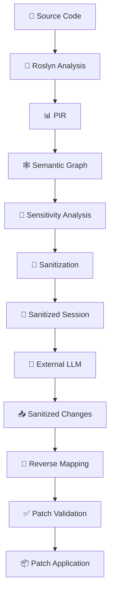
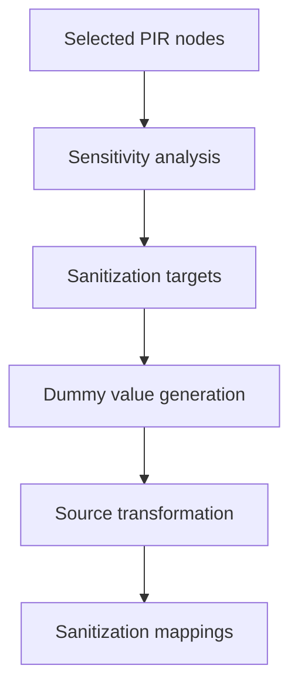
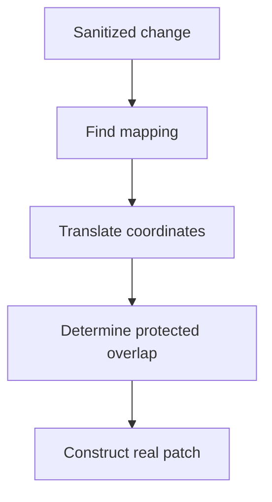
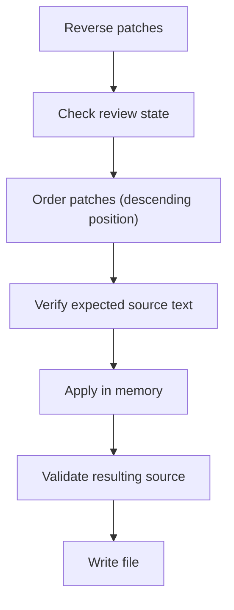
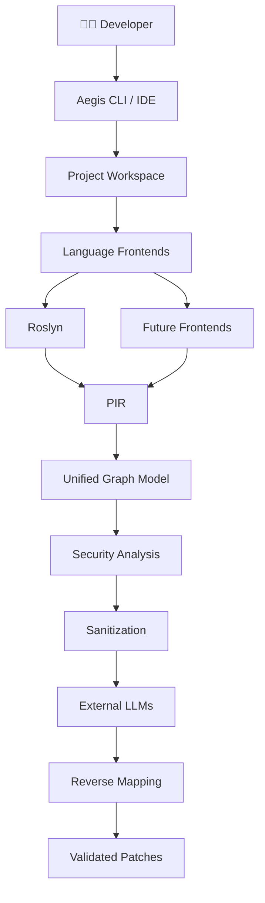

# Aegis Architecture

## 1. Overview

Aegis is a privacy-oriented source transformation pipeline for AI-assisted software development.

The current architecture is centered around:



The architecture is deliberately separated into **analysis**, **transformation**, and **application** stages.

---

## 2. Repository Architecture

```
Aegis/
│
├── apps/
│   ├── cli/
│   └── roslyn-worker/
│
├── packages/
│   ├── graph/
│   ├── indexer/
│   ├── parser/
│   ├── pir/
│   ├── sanitizer/
│   └── shared/
│
├── samples/
│   └── sampleProject/
│
├── tests/
│   └── Sanitizer.Tests/
│
├── ARCHITECTURE.md
├── SECURITY.md
├── TECH_DEBT.md
├── objective.md
└── README.md
```

The current working C# pipeline lives primarily in:

| Package | Path |
|---|---|
| **Roslyn Worker** | `apps/roslyn-worker` |
| **PIR** | `packages/pir` |
| **Graph** | `packages/graph` |
| **Sanitizer** | `packages/sanitizer` |
| **Tests** | `tests/Sanitizer.Tests` |

> The TypeScript CLI structure exists in the repository but is not yet the primary alpha command surface.

---

## 3. High-Level Architecture

```
┌───────────────────┐
│    Source Code     │
└─────────┬─────────┘
          │
          ▼
┌───────────────────┐
│  Roslyn Worker    │
│                   │
│ Syntax + Semantic │
│     Analysis      │
└─────────┬─────────┘
          │
          ▼
┌───────────────────┐
│       PIR         │
│                   │
│ Program Entities  │
└─────────┬─────────┘
          │
          ▼
┌───────────────────┐
│   Graph Engine    │
│                   │
│ Dependencies      │
│ Calls             │
│ Data Flow         │
│ Relationships     │
└─────────┬─────────┘
          │
          ▼
┌───────────────────┐
│    Sensitivity    │
│     Analysis      │
└─────────┬─────────┘
          │
          ▼
┌───────────────────┐
│    Sanitizer      │
│                   │
│ Real → Dummy      │
│ Mapping           │
└─────────┬─────────┘
          │
          ▼
┌───────────────────┐
│  Sanitized        │
│     Session       │
└─────────┬─────────┘
          │
          ▼
    External LLM
          │
          ▼
┌───────────────────┐
│ Modified          │
│ Sanitized Source  │
└─────────┬─────────┘
          │
          ▼
┌───────────────────┐
│ Change Detector   │
└─────────┬─────────┘
          │
          ▼
┌───────────────────┐
│ Reverse Mapper    │
│                   │
│ Dummy → Real      │
└─────────┬─────────┘
          │
          ▼
┌───────────────────┐
│ Patch Validator   │
└─────────┬─────────┘
          │
          ▼
┌───────────────────┐
│ Patch Application │
└─────────┬─────────┘
          │
          ▼
    Real Source
```

---

## 4. Roslyn Worker

The Roslyn worker is responsible for converting C# source code into semantic information that the rest of Aegis can consume.

It uses:

- `Microsoft.CodeAnalysis`
- `Microsoft.CodeAnalysis.CSharp`

The worker currently:

1. Reads C# source files.
2. Creates syntax trees.
3. Creates a C# compilation.
4. Obtains semantic models.
5. Resolves symbols.
6. Maps declarations into PIR nodes.
7. Maps semantic relationships.
8. Resolves source selections.
9. Runs the analysis pipeline.

---

## 5. Two-Pass Mapping

The Roslyn-to-PIR mapper uses two major passes.

### Pass 1 — Declaration Mapping

The first pass creates PIR nodes for program entities.

Examples:

| Entity Type |
|---|
| Namespace |
| Class |
| Interface |
| Constructor |
| Method |
| Parameter |
| Property |
| Field |
| LocalVariable |

During this pass the mapper populates lookup structures used by later analysis.

```
Syntax / Symbol
      │
      ▼
   PIR Node
      │
      ├──── node lookup
      │
      └──── symbol lookup
```

> The goal is to establish the program's entities before relationships are created.

---

## 6. Pass 2 — Semantic Relationships

The second pass analyzes semantic relationships between the previously created PIR nodes.

Current relationships include:

| Relationship | Description |
|---|---|
| `DECLARES` | Parent declares a child entity |
| `CALLS` | A method invokes another method |
| `READS` | A method reads a field or property |
| `FLOWS_TO` | A value flows from one entity to another |
| `IMPLEMENTS` | A class implements an interface member |

Additional relationships can be added as the analysis model evolves.

> The separation between declaration mapping and relationship mapping is important because relationships often require symbols and PIR nodes created during the first pass.

---

## 7. Semantic Symbol Resolution

Roslyn symbols are used instead of relying exclusively on syntax names.

This allows Aegis to distinguish between entities that may have identical names but represent different declarations.

The mapper maintains lookup structures for:

- Classes
- Methods
- Fields
- Properties
- Parameters
- Local Variables

> Local variables require special handling because their symbols are not resolved in exactly the same way as top-level declarations.

---

## 8. PIR

**PIR** stands for **Program Intermediate Representation**.

PIR provides a simplified representation of program entities used by the analysis layers.

Current node types include:

| Node Type |
|---|
| `Namespace` |
| `Class` |
| `Interface` |
| `Constructor` |
| `Method` |
| `Parameter` |
| `Property` |
| `Field` |
| `LocalVariable` |

A PIR node currently contains information such as:

| Property | Description |
|---|---|
| `Id` | Unique identifier |
| `Type` | Node type (from enum) |
| `Name` | Entity name |
| `DataType` | Declared data type |
| `Accessibility` | Access modifier |
| `Modifiers` | Additional modifiers |
| Initializer info | Whether/what kind of initializer |

**Example:**

```
Field
  Name:          password
  Type:          Field
  Accessibility: Private
  Initializer:   StringLiteral
```

---

## 9. PIR and Source Positions

PIR intentionally **does not** own source positions.

Source locations belong to the Roslyn/source-mapping layer.

This separation keeps PIR focused on program meaning rather than a particular source representation.

The sanitizer and mapping layers use source locations when transforming actual source text.

```
PIR                              Roslyn / Source Mapping
 │                                │
 │ semantic identity              │ source coordinates
 ▼                                ▼
Analysis                         Transformation
```

---

## 10. Graph Architecture

The graph layer represents relationships between PIR nodes.

A graph contains nodes and relationships such as:

```
Class
  │
  ├── DECLARES ──── Field
  │
  └── DECLARES ──── Method

Method
  │
  └── CALLS ──── Method

Field
  │
  └── FLOWS_TO ──── LocalVariable

LocalVariable
  │
  └── FLOWS_TO ──── LocalVariable
```

The graph supports both **outgoing** and **incoming** relationship traversal.

> This is important because dependency analysis may need to reason both about what a node depends on **and** what depends on a node.

---

## 11. Dependency Slices

The graph analyzer can construct a **dependency slice** around a selected PIR node.

For example, selecting `token` may produce:

| Type | Name |
|---|---|
| `LocalVariable` | token |
| `LocalVariable` | backup |
| `Field` | password |
| `Method` | Login |
| `Method` | Validate |

The slice can be traversed through both incoming and outgoing relationships.

> This allows Aegis to preserve relevant context around a selected source element.

---

## 12. Sensitivity Analysis

The sensitivity analyzer assigns a sensitivity level to PIR nodes.

| Level | Description |
|---|---|
| `Public` | No protection needed |
| `Internal` | Low sensitivity |
| `Sensitive` | Should be considered for protection |
| `Secret` | Must be protected |

The current analyzer uses signals such as:

- Sensitive identifier names
- Restricted accessibility
- Constants
- String literal initializers
- Object creation initializers

**Example:**

```
password
    │
    ├── sensitive identifier
    ├── private
    ├── string initializer
    │
    ▼
  Secret
```

> The current implementation is intentionally heuristic. It should not be considered a complete secret detector.

---

## 13. Sensitivity Propagation

Sensitivity can **propagate** through the dependency graph.

```
password        ← Secret
    │
    │ FLOWS_TO
    ▼
  token         ← inherits sensitivity
    │
    │ FLOWS_TO
    ▼
  backup        ← inherits sensitivity
```

If `password` is classified as sensitive, dependent nodes can inherit that sensitivity through graph traversal.

> This allows Aegis to reason about derived data rather than only explicit secret names.

---

## 14. Source Selection

The selection layer converts a source-code selection into one or more semantic program entities.

The current implementation resolves selections using Roslyn syntax and semantic information.

```
Selected source range
        │
        ▼
Local declaration
        │
        ▼
VariableDeclarator
        │
        ▼
PIR LocalVariable
```

> This allows sanitization to operate on program entities instead of arbitrary character ranges whenever possible.

---

## 15. Sanitization Pipeline

The sanitizer transforms real source into a sanitized representation.



A mapping records the relationship between:

| Field | Description |
|---|---|
| Original text | The real value |
| Dummy text | The replacement value |
| Original source position | Where in the real source |
| Sanitized source position | Where in the sanitized source |
| PIR node identity | Which program entity |

---

## 16. Deterministic Dummy Values

The current sanitizer uses deterministic dummy values based on the semantic role of a protected identifier.

| Original Identifier | Dummy Value |
|---|---|
| `password` | `DUMMY_PASSWORD` |
| `apiKey` | `DUMMY_API_KEY` |
| `accessToken` | `DUMMY_ACCESS_TOKEN` |
| `privateKey` | `DUMMY_PRIVATE_KEY` |
| `connectionString` | `DUMMY_CONNECTION_STRING` |

> The goal is to retain semantic context without exposing the original value.

---

## 17. Sanitization Sessions

A sanitization session captures the state required for the return trip.

A session contains:

```
Session
   │
   ├── Session ID
   │
   └── For each file:
        │
        ├── Original file path
        ├── Sanitized file path
        ├── Baseline sanitized file path
        ├── Original source hash
        ├── Sanitized source hash
        └── Source mappings
```

Conceptually:

```
Session
   │
   ├── Original source hash
   ├── Sanitized baseline
   ├── Current sanitized source
   └── Real ↔ Dummy mappings
```

> The session is stored locally under `.aegis/`.

---

## 18. Source Integrity

Aegis uses **SHA-256** source hashes to detect changes to the original source.

**When a session is created:**

```
Original source → SHA-256 → Session metadata
```

**During import:**

```
Current source → SHA-256 → Compare with session hash
                                │
                                ├── match ──── Continue
                                │
                                └── mismatch ── ⚠ REVIEW
```

> A mismatch prevents automatic patch application. This prevents stale mappings from being applied to a different version of the source.

---

## 19. Sanitized Change Detection

After the developer modifies the sanitized source, Aegis compares:

```
Baseline sanitized source
          │
          ▼
    Change detector
          │
          ▼
Modified sanitized source
```

The current implementation detects line-level operations including:

| Operation |
|---|
| `Equal` |
| `Replace` |
| `Delete` |
| `Insert` |

Each resulting change contains:

| Field | Description |
|---|---|
| File path | Which file was changed |
| Start | Offset in the source |
| Original length | Length of original text |
| Original text | The baseline text |
| New length | Length of new text |
| New text | The modified text |

> These changes become the input to the reverse-mapping stage.

---

## 20. Reverse Mapping

The reverse mapper converts changes in sanitized coordinates back into real source coordinates.



The reverse mapper performs **conservative** checks:

- Mapping must correspond to known source regions.
- Partial protected overlaps are not automatically accepted.
- Protected dummy values must be handled explicitly.
- Ambiguous changes require review.
- The reconstructed original text must match the real source.

---

## 21. Protected Regions

Sanitized protected values are represented as **protected regions** during reverse mapping.

```diff
  Real:       "abc123"
                 ↓ sanitize
  Sanitized:  "DUMMY_PASSWORD"
                 ↓
              Protected region
```

If the sanitized result changes the protected region unexpectedly, Aegis does **not** blindly translate that change into the real source.

Instead:

```
Protected overlap → ⚠ Review required
```

---

## 22. Patch Model

A reverse patch contains:

| Field | Description |
|---|---|
| `FilePath` | Target file |
| `Start` | Character offset |
| `Length` | Length of original text |
| `OriginalText` | Expected text at location |
| `ReplacementText` | New text to apply |
| `RequiresReview` | Whether human review is needed |
| `Reason` | Explanation if review is required |

A patch represents a change that can potentially be applied to the real source.

> Before application, patches must **not** require review.

---

## 23. Patch Application

Patch application is deliberately separated from patch analysis.



Multiple patches are applied from **highest source position to lowest** source position.

> This prevents earlier replacements from invalidating the coordinates of later patches.

---

## 24. Patch Validation

The current validator performs syntax validation using Roslyn.

```
Original source
      │
      + patch
      ▼
Patched source
      │
      ▼
C# syntax parsing
      │
      ├── errors ──── ❌ Reject
      │
      ▼
      ✅ Valid
```

> The current alpha does not perform full compilation validation. The architecture contains a compilation-error field for future expansion, but syntax validation is the current implemented validation layer.

---

## 25. Patch Application Safety

Before writing the patched source to disk, Aegis verifies:

| Check | Description |
|---|---|
| **Source still exists** | The original file must still exist. |
| **Source has not changed** | The current SHA-256 hash must match the session hash. |
| **Patches do not require review** | Any review-required patch stops automatic application. |
| **Patch coordinates are valid** | A patch must remain inside the source range. |
| **Expected source text matches** | The source at the patch location must match the text recorded by the patch. |
| **Resulting source is syntactically valid** | The resulting source must parse without syntax errors. |

> Only after **all** checks succeed is the file written.

---

## 26. Failure Model

Aegis follows a **fail-closed** approach for the reverse-mapping pipeline.

```
            Change
              │
              ▼
       Can it be mapped?
         /           \
       YES            NO
        │              │
        ▼              ▼
     Validate        Review
        │
        ▼
      Apply
```

Examples of conditions that stop automatic application:

- Original source changed
- Missing session files
- Invalid mapping
- Protected-region ambiguity
- Protected dummy modification
- Invalid patch coordinates
- Expected source mismatch
- Syntax errors after patching

---

## 27. Current Alpha Boundary

The current alpha boundary is intentionally **local**:

```
┌──────────────────────────────────────────────────┐
│                     Aegis                        │
│                                                  │
│  Analyze → Sanitize → Session → Import           │
│                → Map → Validate → Apply          │
└─────────────────────────┬────────────────────────┘
                          │
                          │ sanitized source
                          ▼
                   External LLM
```

> Aegis does not currently manage the external LLM interaction. The developer manually transfers the sanitized representation to and from the external LLM.

---

## 28. Architectural Principles

**Separation of concerns** — each layer should have one primary responsibility:

| Layer | Responsibility |
|---|---|
| **Roslyn** | Understand C# source |
| **PIR** | Represent program entities |
| **Graph** | Represent relationships |
| **Sensitivity** | Classify protected nodes |
| **Sanitizer** | Transform source |
| **Session** | Preserve round-trip state |
| **Change** | Detect sanitized edits |
| **Reverse** | Map sanitized edits |
| **Validator** | Verify resulting source |
| **Applier** | Modify files |

**Semantic analysis before transformation** — Aegis should understand the relevant program entities before transforming source.

**Conservative reverse mapping** — the system should prefer review over guessing.

**Source integrity** — a patch must be associated with the exact source version against which it was created.

**LLM independence** — the core analysis and transformation engine should remain independent from individual LLM providers.

---

## 29. Current Architectural Limitations

The current implementation intentionally has several limitations:

| Limitation | Description |
|---|---|
| **Manual compilation** | The Roslyn worker creates a `CSharpCompilation` with manually supplied metadata references. Sufficient for the alpha but does not reproduce a real project's full build environment. |
| **Temporary PIR packages** | Individual source files create temporary PIR packages which are later merged at the project level. |
| **Mapper state** | The Roslyn mapper maintains several internal lookup structures. |
| **Limited semantic relationships** | The relationship model is still evolving. |
| **Heuristic sensitivity** | Sensitivity detection is not complete information-flow security. |
| **Line-level change detection** | Sanitized changes are detected primarily at line granularity. |

> These limitations are tracked in [TECH_DEBT.md](TECH_DEBT.md).

---

## 30. Future Architecture

The long-term architecture is expected to evolve toward:



> The architecture should eventually support additional languages through language-specific frontends producing the same intermediate representation.

---

## 31. Architecture Invariants

The most important architectural invariant is:

> **The LLM-facing representation should not require Aegis to expose the original protected values in order for the LLM to perform useful development work.**

The second important invariant is:

> **Aegis must not automatically apply a reverse-mapped change when it cannot establish a sufficiently reliable relationship between the sanitized change and the real source.**