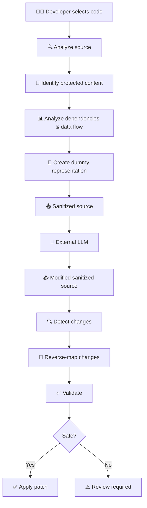
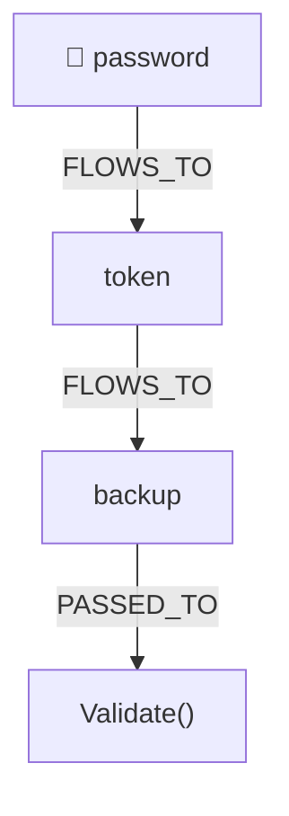
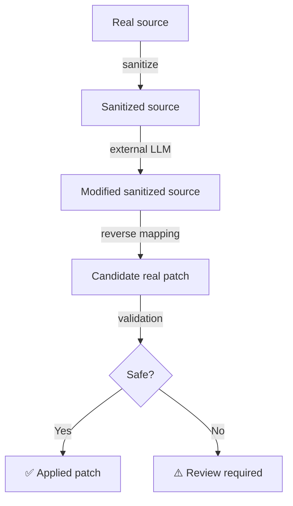
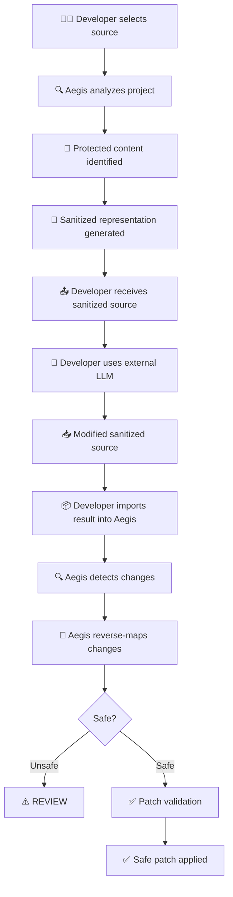
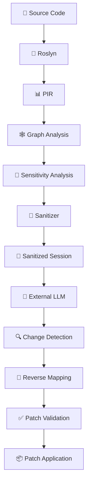
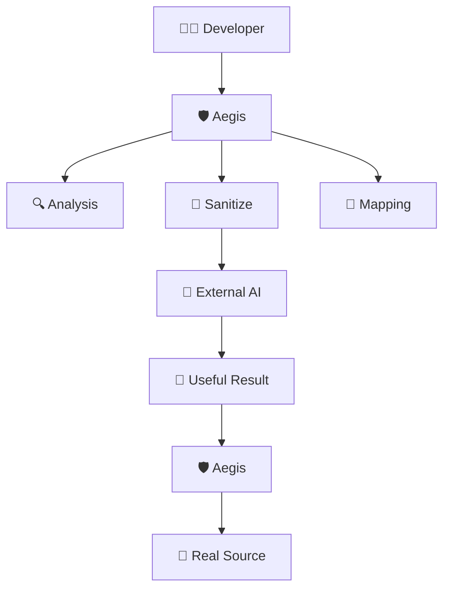

<div align="center">

# 🛡️ Aegis — Objective

### The product vision, design philosophy, and engineering foundation.

<br />

> **Allow developers to use external LLMs with their real code — without unnecessarily exposing sensitive or proprietary parts of that code to the LLM.**

</div>

---

## 1. Core Objective

Aegis is a developer-focused **privacy layer** for AI-assisted software development.

Aegis achieves this by analyzing source code, transforming identified protected content into safe dummy representations, preserving useful program context, and maintaining enough mapping information to translate useful LLM-generated changes back to the developer's real source.



---

## 2. The Problem

Developers increasingly use LLMs for:

| Use Case | |
|---|---|
| ✍️ Writing code | 🐛 Debugging |
| 🔍 Code review | 🔄 Refactoring |
| 🧪 Test generation | 📚 Documentation |
| 💡 Code explanation | ⚡ Optimization |

Real codebases, however, can contain information that should **not** be exposed to external LLM providers:

- 🔑 API keys
- 🔐 Passwords & access tokens
- 🗝️ Private keys
- 🗄️ Connection strings
- 🌐 Internal API formats & URLs
- 👤 Customer information
- 🏢 Proprietary identifiers
- 🧠 Confidential business logic
- 📦 Proprietary implementation details

**Manually removing this information is error-prone.**

Simple text replacement is also insufficient because sensitive information can **propagate** through the program.

---

## 3. Why Program Analysis Is Required

Consider:

```csharp
private string password = "abc123";

public void Login()
{
    string token = password;
    string backup = token;

    Validate(backup);
}
```

The sensitive value originates from `password` but later flows through:



A text-based sanitizer may identify `password` but fail to understand that `token` and `backup` are derived from it.

Aegis therefore uses program analysis to understand:

| Layer | Purpose |
|---|---|
| Program entities | What exists in the code |
| Semantic symbols | What each entity represents |
| Relationships | How entities relate to each other |
| Dependencies | What depends on what |
| Data flow | Where values travel |
| Sensitivity | What needs protection |
| Source mappings | How to translate back |

> The analysis infrastructure exists to support the sanitization workflow.

---

## 4. Sanitization

Aegis transforms identified protected values into deterministic dummy representations.

````carousel
**Real source:**
```csharp
public class AuthService
{
    private string password = "abc123";

    public void Login()
    {
        string token = password;
        Validate(token);
    }
}
```
<!-- slide -->
**Sanitized source:**
```csharp
public class AuthService
{
    private string password = "DUMMY_PASSWORD";

    public void Login()
    {
        string token = password;
        Validate(token);
    }
}
```
````

The goal is **not** to destroy the code's meaning.

The sanitized representation should **preserve**:

- ✅ Program structure
- ✅ Types
- ✅ Control flow
- ✅ Method signatures
- ✅ Relationships
- ✅ Relevant data flow
- ✅ Non-protected names
- ✅ Context required for the requested task

While **removing**:

- ❌ Protected values

---

## 5. Result Mapping

Sanitization alone is not enough.

The developer must eventually be able to **use the LLM's result** with the real source.

For example, the LLM may change:

```diff
- string token = password;
+ string token = Hash(password);
```

Aegis compares the modified sanitized source against the original sanitized baseline and attempts to map the change back to the real source.



> If a change cannot be mapped safely, Aegis should **require review** rather than guessing.

---

## 6. Core Product Principle

Aegis is **not** primarily a blocking system.

The primary goal is **not**:

```
Sensitive data detected → ❌ BLOCK LLM
```

The primary goal **is**:

```
Real code → Sanitize → Dummy representation → External LLM
    → Useful result → Map back → Validate → Real source ✅
```

Blocking or review can still be used when Aegis cannot safely transform or map a change.

---

## 7. LLM-Agnostic Design

Aegis does **not** depend on a specific LLM provider.

The current alpha deliberately uses a human-in-the-loop workflow:

```
Aegis → Sanitized source → Developer → Any LLM → Modified source → Aegis
```

This means the developer can use the LLM they already prefer:

| | Provider | Supported? |
|---|---|---|
| 🟢 | ChatGPT | ✅ |
| 🟢 | Claude | ✅ |
| 🟢 | Gemini | ✅ |
| 🟢 | Local models | ✅ |
| 🟢 | Any other provider | ✅ |

> Direct LLM integrations are outside the current alpha scope.

---

## 8. Current Alpha Scope

The current alpha focuses on proving the **complete sanitized-code round trip** for C#.

The implemented pipeline includes:

| Phase | Capabilities |
|---|---|
| **Parsing** | Roslyn source parsing, semantic symbol resolution |
| **Representation** | PIR, semantic relationships, dependency graph |
| **Analysis** | Source selection, sensitivity analysis, local-variable analysis, data-flow relationships, multi-hop dependency traversal, sensitivity propagation |
| **Sanitization** | Deterministic sanitization, real-to-dummy mappings, sanitized sessions, source hashing |
| **Reverse Mapping** | Sanitized change detection, reverse mapping, protected-value tamper detection |
| **Application** | Patch generation, syntax validation, safe patch application |
| **Testing** | End-to-end round-trip testing |

> The alpha deliberately focuses on the **core workflow** rather than broad product integrations.

---

## 9. Alpha Workflow

The current alpha proves this workflow:



> The current alpha does **not** automatically communicate with external LLM providers.

---

## 10. Alpha Success Criterion

The alpha is successful if a developer can:

1. ✅ Select real C# source containing protected information.
2. ✅ Analyze the relevant source and dependencies.
3. ✅ Produce a sanitized representation.
4. ✅ Use that representation with an external LLM.
5. ✅ Import the modified sanitized source.
6. ✅ Detect the LLM-generated changes.
7. ✅ Map compatible changes back to the real source.
8. ✅ Reject unsafe or ambiguous changes.
9. ✅ Validate safe changes.
10. ✅ Apply the resulting patch without exposing the protected value to the LLM-facing representation.

> **In short:** Aegis should make it possible to use external LLMs on sanitized representations of proprietary code while retaining a reliable path back to the real source.

---

## 11. Current Engineering Foundation

The current implementation is built around several layers:



These components are implementation mechanisms supporting the product objective.

The product itself remains the developer workflow:

**`SELECT → SANITIZE → SEND TO LLM → GET RESULT → MAP → VALIDATE → APPLY`**

---

## 12. Security Principle

Aegis follows a conservative reverse-mapping principle:

> **When Aegis cannot safely determine how a sanitized change corresponds to the real source, it should not automatically apply the change.**

This applies to situations such as:

- 🛑 Protected dummy values being modified unexpectedly
- 🛑 Ambiguous mappings
- 🛑 Partial protected-region overlap
- 🛑 Stale original source
- 🛑 Invalid patch coordinates
- 🛑 Invalid resulting source

The preferred behavior is:

| Scenario | Outcome |
|---|---|
| ✅ Safe | Validate → **Apply** |
| ⚠️ Unsafe / Ambiguous | Review → **Do not modify real source** |

---

## 13. What Aegis Is Not

Aegis is **not** primarily:

- ❌ A generic secret scanner
- ❌ A vulnerability scanner
- ❌ A code-quality analyzer
- ❌ A generic DLP platform
- ❌ A generic LLM firewall
- ❌ A general-purpose static-analysis platform

These capabilities may support the product, but the central objective remains:

> **Sanitize selected real code before an external LLM sees it, preserve enough context for useful LLM work, and map compatible results back to the developer's real code.**

---

## 14. Current Limitations

The current alpha is intentionally incomplete. It does **not** yet provide:

- Direct LLM integrations
- VS Code integration
- Automatic LLM submission / response retrieval
- Multi-language analysis
- Full MSBuild project loading
- Complete secret detection
- Complete proprietary-code detection
- Formal semantic-equivalence verification
- Cloud infrastructure
- Enterprise policy management

> These are future capabilities rather than requirements for the current alpha.

---

## 15. Guiding Principles

Every Aegis feature should ultimately support one question:

> **Can we give an external LLM enough information to perform the developer's requested task while keeping information that should remain private out of the LLM-facing representation?**

| Principle | Description |
|---|---|
| 🔒 **Privacy** | Protected information should not be unnecessarily exposed. |
| 🧩 **Context preservation** | Sanitization should not destroy information required for useful development work. |
| 🔄 **Reliable mapping** | Dummy representations and returned changes should map reliably to real source entities. |
| 🛡️ **Conservative application** | Ambiguous changes should require review rather than being guessed. |
| ⚡ **Minimal friction** | The workflow should fit naturally into the developer's existing LLM workflow. |
| 🌐 **LLM independence** | Aegis should not require a specific AI provider. |

---

## 16. Long-Term Vision

The long-term vision is a privacy layer that sits naturally inside the developer's AI-assisted workflow:



The complexity of program analysis, semantic relationships, data-flow tracking, sensitivity analysis, sanitization, and reverse mapping should remain **underneath** a simple developer experience.

The intended experience is:

<div align="center">

**`SELECT → SANITIZE → SEND → GET RESULT → MAP → APPLY`**

<br />

*That is the product Aegis is being built toward.*

</div>
